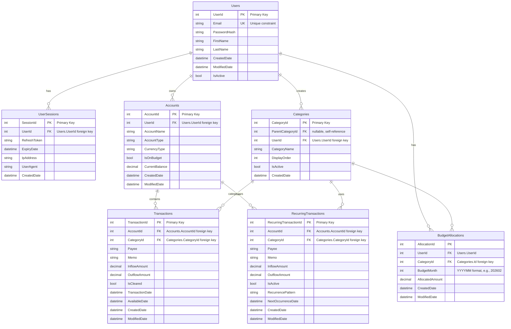

---
categories:
  - "[[Project]]"
title: Flagship Project - Budgeting app
started: 2026-02-23
updated: 2026-02-23
---

# Project requirements

- [ ] Your project needs to contain a Readme with an overview of the system, justification of your choices and instructions on how to run the application. An initial PR needs to be created with this document and a diagram file (the format is up to you). This PR is a requirement to achieve Grey Belt.
- [ ] You need to build a full-stack web app with front-end, back-end and database. You can choose any front-end technology, but the back end has to be .NET/C#.
- [ ] If you have an amazing idea that doesn't require a front-end, let us know so we can assess it.
- [ ] Authorization/authentication, including at least one external provider.
- [ ] Interaction with an external api. If you don't find a free API that suits your idea, create one and seed the data
- [ ] You need to use at least two Azure Functions.
- [ ] Your project will be thoroughly tested. Make sure errors are handled properly.
- [ ] Logging and monitoring capabilities. You can choose a service of your choice.
- [ ] You need to deploy your solution to Azure and produce a link to the website.

# Features

- [ ] User authorization/authentication
- [ ] User scoped data
- [ ] Importing and export data
- [ ] Reports
- [ ] Separate views for budgeting and transactions
- [ ] Multiple bank accounts
- [ ] Recurring transactions
- [ ] Quick fill for monthly budgets based on last month's budget or outflows

# Technology stack

## Backend

| Component          | Technology               |
| ------------------ | ------------------------ |
| **Framework**      | ASP.NET Core             |
| **Language**       | C#                       |
| **Database**       | SQL Server               |
| **ORM**            | Entity Framework Core    |
| **API**            | REST                     |
| **Authentication** | [OAuth 2.0/JWT/Azure AD] |
| **Caching**        | [Redis/In-Memory]        |

Since the project requirements ask for a C# / .NET backend the choice naturally falls to ASP.NET Core. The combination of SQL Server and EF Core are integrated very well within ASP.NET Core. According to some YouTubers [^1] it's better to learn PostgreSQL, but I'm already familiar with SQL Server.

When it comes to REST vs GraphQL. The way I see the backend for the first minimum viable product is as a simple CRUD facilitator. Maybe once the development scope moves to the reporting requirements there might be a case for GraphQL. But even then I think for this project I should stick with REST as I have more experience with that.

As for authentication, one of the project requirements is deployment to Azure. I think it has some authorisation and authentication features, but I'm not familiar enough with Azure so I need to do some research first.

For caching I'll start with in-memory for the minimum viable product and then maybe later move to Redis. Here again I'm constraint by my experience.

## Frontend

| Component            | Technology          |
| -------------------- | ------------------- |
| **Framework**        | React               |
| **Language**         | TypeScript          |
| **Styling**          | React-Bootstrap     |
| **State Management** | [Redux/React Query] |

For the frontend I would've preferred to chose Angular as it seems to be the most combination with a .NET backend. However according to YouTubers [^1] it doesn't matter much between those 2. As long as it's not Blazor [^2]. I'm the most familiar with React so I'll stick with that. I'll use TypeScript due to my preference for strictly typed languages. And it being a Microsoft language fits with the backend stack.

Styling wise bootstrap in combination with the React-Bootstrap component library. Here again because of my experience and ease of use.

For state management I might start with Query for the API caching. Then depending on the scope of the front-end I might use Redux for the rest.

## DevOps

| Component            | Technology                       |
| -------------------- | -------------------------------- |
| **Cloud Platform**   | Azure                            |
| **Containerization** | Docker                           |
| **CI/CD Pipeline**   | GitHub Actions                   |
| **Monitoring**       | [Application Insights/ELK Stack] |
| **Logging**          | [Serilog/NLog]                   |

Azure is a project requirement, so that will the cloud platform where the full stack app will be hosted on.

Docker and GitHub Actions due to my experience with those. Maybe I could replace GitHub with Azure, but I only have minimal experience with Azure, so I don't feel confident enough to make it my primary choice.

Monitoring and logging are both a grey area where I need to do more research.

# Design

## ERD

## Screen examples
YNAB 4 is the main inspiration behdin this app. So my focus will mostly be on the app looking similar feature wise. Budgetzero is an open source alternative that I also could take some inspiration from.

_An open source alternative to YNAB_

_The budget view from YNAB 4_

_The transaction view from YNAB 4_

# Challenges

- How to handle assigned budgets and transactions for deleted categories?
- How to encrypt the data using sql server?

[^1]: https://youtu.be/WYBZTraXlXQ
[^2]: https://www.youtube.com/watch?v=Wn_wVkeGPYs
